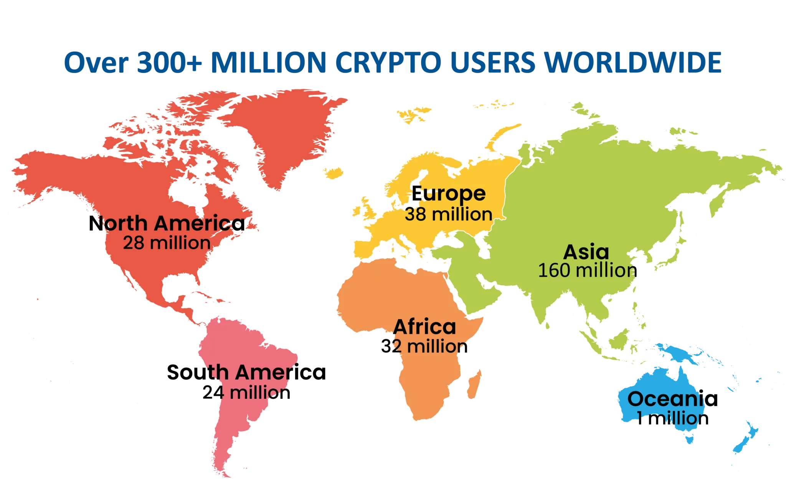
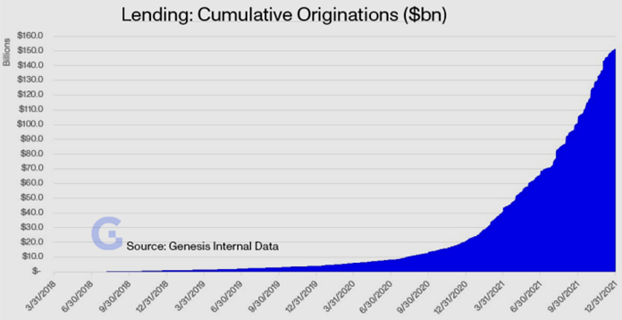

# BlockFi CaseStudy
 
BlockFi was founded in 2017 by Zac Prince and Flori Marquez.

BlockFi is a centralized crypto lender, where assets are held with a custodian on the BlockFi platform—bridging traditional finance and crypto-asset markets by providing savings, credit, and trading products to crypto holders. BlockFi was created to provide credit services to markets with limited access to simple financial products. They raised a total of $508.7M in funding over 16 rounds. Their latest funding was raised on Jan 3, 2022, from a Secondary Market round. [Cited: CrunchBase](https://www.crunchbase.com/organization/blockfi-inc)

Thousands of people have made millions of dollars by buying and hodling bitcoin and other cryptocurrencies. But to spend the currency they need to sell their coins. That's a problem, because selling triggers capital gains taxes in the US, and because most crypto-wealthy people believe bitcoin will only keep going up in value over time, holding onto the coin is the best option. BlockFi solves this problem by offering USD loans backed by bitcoin and other cryptocurrencies as collateral. BlockFi also provides interest accounts, cryptocurrency trading, and crypto rewards.

BlockFi's target customer is underserved crypto investors. As of 2021, it's estimated that there are over 300 million crypto users worldwide. [Cited: TripleA](https://triple-a.io/crypto-ownership/)

BlockFi applications and data uses JavaScript, React, HTML5, NGINX,PostgreSQL, TypeScript, Amazon EC2, CSS 3 and React Native. Their developer operations use GitHub, Git, Docket, and Ansible [Cited: Stackshare](https://stackshare.io/blockfi/blockfi)
 
BlockFi has seen incredible growth over the past four years as crypto investing and financial services have moved to the mainstream. They recently launched a new credit card that allows clients to accumulate rewards in cryptocurrency. Improving the loan experience is their priority by making it easier to pay down loans and get up-to-date loan and payment status information. They also want to prioritize expanding internationally.
 
Cryptocurrency-backed loans are becoming a competitive space. Companies like Nexo, Celsius, and Salt offer rates on their loans as low as 1%.
 
As an example of the size of this market, Genesis, one of the largest OTC players, claims $150B in cumulative originations and a current loan book of $12.5B. [Cided: VanEck](https://www.vaneck.com/us/en/blogs/digital-assets/matthew-sigel-crypto-lending-and-the-search-for-yield/)
 

 
 
Although, BlockFi is a major player in the crypto-loan space. They recently had to pay a penalty of $100 Million to the SEC and file registration of its crypto lending products. They "also agree to attempt to bring its business into compliance with the Investment Company Act of 1940 within 60 days." [Cited: SEC.gov](https://www.sec.gov/news/press-release/2022-26)
 
If I were to advise BlockFi to add new products I would ask that they offer reward debit cards.  This would be similar to their credit cards rewards without having to apply for credit. This would allow more users to gain crypto rewards. Their competitors are offering higher rates for their interest accounts and that is making people switch to their competitors like Celsius
 
 
 
 
 
 
 
 

